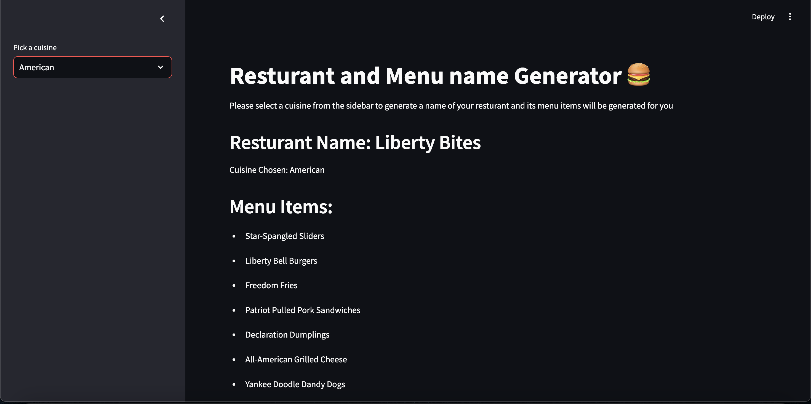

# 🍔 Restaurant and Menu Name Generator

Welcome to the **Restaurant and Menu Name Generator**! This application uses AI to generate creative restaurant names and menu items based on the chosen cuisine. It's perfect for brainstorming unique names for your restaurant business or just for fun!


## 🚀 Features
- **Wide Range of Cuisines**: Choose from Italian, Mexican, American, Chinese, Indian, Arabic, Japanese, Lebanese, and French cuisines.
- **AI-Powered Suggestions**: Get AI-generated restaurant names and corresponding menu items.
- **User-Friendly Interface**: Simple and intuitive layout with a sidebar for cuisine selection.
- **Real-Time Results**: See results instantly after selecting a cuisine.

## 🛠️ Technologies Used
- **Python**: Backend language for the application.
- **Streamlit**: Framework for building an interactive web application.
- **LangChain**: Used for building the AI chain logic.
- **ChatGroq**: AI model to generate names and menu items.
- **Prompt Engineering**: For custom instructions to the AI.


## 🧠 Key Concept: SequentialChain in LangChain
This project leverages the **SequentialChain** concept from LangChain to process information in a structured flow:
1. **Step 1**: Generate a restaurant name based on the selected cuisine.
2. **Step 2**: Use the generated restaurant name to create a list of menu items.

## 🖥️ How It Works
1. Select a cuisine from the sidebar.
2. The app sends the selected cuisine to the AI model.
3. The AI generates:
   - A creative name for the restaurant.
   - A list of menu items for the chosen cuisine.
4. Results are displayed on the main page.



## 🏗️ Installation and Setup

### Prerequisites
- Python 3.8 or higher
- Streamlit installed (`pip install streamlit`)
- LangChain and ChatGroq libraries installed:
  ```bash
  pip install langchain chatgroq
  ```

### Steps
1. Clone the repository:
   ```bash
   git clone https://github.com/yourusername/restaurant-menu-generator.git
   cd restaurant-menu-generator
   ```
2. Install dependencies:
   ```bash
   pip install -r requirements.txt
   ```
3. Run the app:
   ```bash
   streamlit run app.py
   ```
4. Open the app in your browser at `http://localhost:8501`.

## 🔑 API Key Setup
To use the ChatGroq API, ensure you replace the placeholder `groq_api_key` with your valid API key in the code:
```python
groq_api_key="your_groq_api_key_here"
```

## 📦 File Structure
```
restaurant-menu-generator/
├── main.py                # Main application file
├── requirements.txt      # List of dependencies
└── README.md             # Project documentation
├── learn.ipynb
```


